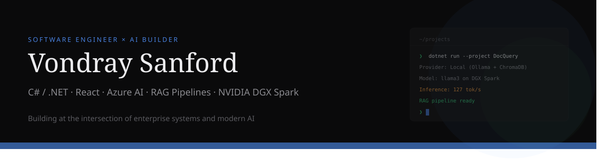

## Hey, I'm Vondray 👋

.NET full-stack engineer with experience building high-volume enterprise applications — now going deep on AI engineering.

I build production systems that process real data at scale (including $1.5T in historical insurance data), and I'm channeling that engineering discipline into modern AI: RAG pipelines, multi-agent workflows, and local LLM inference on my NVIDIA DGX Spark.

---

### 🔨 What I'm Building

**[DocQuery](https://github.com/YOUR_USERNAME/docquery)** — A dual-mode RAG application for querying documents with natural language. Supports both local inference (Ollama on DGX Spark) and Azure OpenAI. Built with C#/.NET 8 and React. Currently using it as my AI-102 study partner.

*More projects coming soon — MCP toolkit, agent orchestration framework, and DGX Spark benchmarks.*

---

### 🛠 Tech I Work With

**Daily drivers:** C#, .NET Core, ASP.NET, T-SQL, SQL Server, React, JavaScript

**AI & ML:** Azure AI Services, Ollama, RAG Pipelines, LLM Integration, Prompt Engineering

**Infrastructure:** NVIDIA DGX Spark, Azure Cloud, Docker, Git, IIS

---

### 📜 Certifications

✅ **Azure AI Fundamentals (AI-900)** — Microsoft Certified

📖 **Azure AI Engineer Associate (AI-102)** — In Progress (June 2026)

---

### 📊 Current Focus

- Studying for **AI-102** by building a RAG app that uses the exact Azure services on the exam
- Running local LLM inference and fine-tuning experiments on **DGX Spark**
- Writing about the journey at [vondraysanford.com](https://vondraysanford.com)

---

### 📫 Connect

<!---
olaRDnOM/olaRDnOM is a ✨ special ✨ repository because its `README.md` (this file) appears on your GitHub profile.
You can click the Preview link to take a look at your changes.
--->
