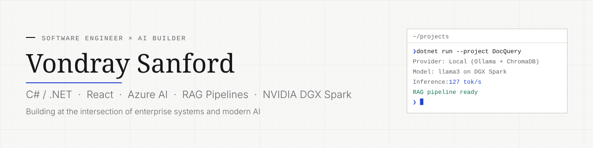

## Hey, I'm Vondray! 👋

Senior Software Engineer with 7+ years building full-stack enterprise systems at scale, now going deep on AI engineering.

I architect C#/.NET applications that process trillions in historical data. I'm channeling that enterprise engineering discipline into modern AI: RAG pipelines, multi-agent workflows, MCP tooling, and local LLM inference on my NVIDIA DGX Spark.

---

### 🔨 What I'm Building

**[DriftWatch](https://github.com/vondraysanford/DriftWatch)** (in progress — building in public) — An end-to-end MLOps pipeline that predicts equipment failure from sensor time-series and, more importantly, stays healthy after deployment: MLflow experiment tracking and registry, DVC-versioned data, GitHub Actions CI/CD to an Azure ML endpoint, and Evidently drift monitoring wired to an automated retrain trigger. The thesis: the model is 20% of an ML system — this project is the other 80%.

*Up next — [SparkBench](https://github.com/vondraysanford/SparkBench)*

---

### 🚀 What I've Shipped 

**[AgentReview](https://github.com/vondraysanford/Agent-Review)** — Multi-agent code review in C#/.NET 10, demo now [live at agentreview.vondraysanford.com](https://agentreview.vondraysanford.com). An orchestrator fans a PR diff out to quality, security, and docs agents that call real tools (Roslyn, Semgrep, GitHub) through MCP, then synthesizes one ranked review. Measured results: 100% precision and human agreement, 17/18 planted-bug recall, $0.068 per review, all traced with OpenTelemetry. Proof that sophisticated agentic patterns work reliably in the .NET ecosystem — not just Python.

**[DocQuery](https://github.com/vondraysanford/docquery)** — A local-first RAG application for querying documents in natural language, built in public with C#/.NET 10 and React. Phases 1–4 complete with a demo now [live at docquery.vondraysanford.com](https://docquery.vondraysanford.com); Phase 5 turns it into a daily study tool.

**[The 10X Engineer Toolkit](https://github.com/vondraysanford/The10XEngineerToolkit)** — A stack-agnostic library of engineering practices packaged for AI coding agents, installable as a Claude Code plugin and portable to any assistant. Skills, agents, prompts, templates, workflows, and configs that codify how great engineers plan, review, and ship — so every ticket, review, and deploy gets the same care automatically.

**[Twitter Sentiment Analysis Bot](https://github.com/vondraysanford/TwitterSentimentAnalysisBot)** — A shipped Python ML pipeline that classifies tweet sentiment and detects automated accounts with an XGBoost model (0.89 ROC AUC on 10K+ accounts), served through an interactive Discord bot. Includes RSA-signed model integrity checks and a full collection-to-deployment data pipeline.

---
### 🔓 Open Source Contributions

- **[MonoGame](https://github.com/MonoGame/MonoGame/pulls?q=author%3Avondraysanford)** (14K+ ⭐) — Authored XML API documentation for the `GraphicsAdapter` and `Album` classes across 2 PRs — **both merged** (Aug 2026)
- **[Cataclysm-DDA](https://github.com/CleverRaven/Cataclysm-DDA/pulls?q=author%3Avondraysanford)** (13K+ ⭐) — Fixed the solar cell's implausible half-meter `longest_side` and added `looks_like` sprite fallbacks for the Xedra Evolved dream weapons across 2 PRs — **both merged** (Aug 2026)
- **[Kana-Dojo](https://github.com/lingdojo/kana-dojo/pulls?q=author%3Avondraysanford)** (3.2K+ ⭐) — Standardized the Japan trivia answer format to support multiple accepted answers and added a「〜ても」grammar entry across 2 PRs — **both merged** (Aug 2026)
- **[KodeKloud AI-102](https://github.com/kodekloudhub/AI-102/pull/1)** — Submitted a security fix replacing hardcoded Azure credentials with placeholders in a public course code sample (open, awaiting review)

---

### 🛠 Tech I Work With

**Languages:** C#, TypeScript, JavaScript, Python, T-SQL, HTML/CSS

**Frameworks:** .NET Core, ASP.NET, React, React Native, Node.js, Entity Framework

**Databases:** SQL Server, PostgreSQL, MySQL, Redis

**Cloud & DevOps:** Azure, Docker, Kubernetes, CI/CD, Azure DevOps, Argo

**AI & ML:** Azure AI Services, Ollama, RAG Pipelines, LLM Integration, Claude Code, GitHub Copilot, MCP, Prompt Engineering

**Hardware:** NVIDIA DGX Spark (local inference and fine-tuning)

---

### 📜 Certifications & Training

| Certification | Issuer | Date |
|---|---|---|
| Azure AI Engineer Associate (AI-102) | Microsoft | Jun 2026 |
| GitHub Copilot (GH-300) | Microsoft | Jun 2026 |
| Azure Fundamentals (AZ-900) | Microsoft | Jun 2026 |
| GitHub Foundations (GH-900) | GitHub | Jun 2026 |
| Azure AI Fundamentals (AI-900) | Microsoft | Apr 2026 |
| Claude Code in Action | Anthropic | Jun 2026 |
| Introduction to Model Context Protocol | Anthropic | Jun 2026 |
| Introduction to Subagents | Anthropic | Jun 2026 |
| Introduction to Agent Skills | Anthropic | Jun 2026 |

📖 **Machine Learning Operations Engineer Associate (AI-300)** — In Progress

---

### 📊 Current Focus

- Studying for the **AI-300** (Microsoft Machine Learning Operations Engineer Associate) — operationalizing ML and generative AI solutions on Azure
- Building **[DriftWatch](https://github.com/vondraysanford/DriftWatch)** in public — training, deploying, and monitoring an ML pipeline on Azure with CI/CD, drift detection, and automated retraining
- Running local LLM inference and fine-tuning experiments on **DGX Spark**
- Sharing what I learn at [vondraysanford.com](https://vondraysanford.com) and on [LinkedIn](https://www.linkedin.com/in/vondray-sanford)

---

### 📫 Connect

<!---
vondraysanford/vondraysanford is a ✨ special ✨ repository because its `README.md` (this file) appears on your GitHub profile.
You can click the Preview link to take a look at your changes.
--->
